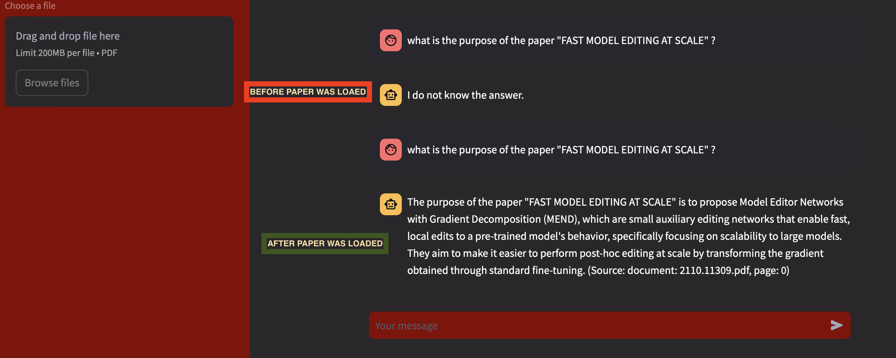

#### To run everything:

python version used: 3.11.5 (could work with less e.g 3.9)

- pip install -r requirements.txt

- flask --app flask_literature_review.py

- streamlit run literature_review_interface.py

#### Configurations in the config.json file: 

- "embeddings_model": Name of the embeddings model you want to load (in case you already use one)
- "max_chunk_size": Max text size to embedd -  you might want to check your maximum chunk size if you use a different embeddings model than the default,
- "parser_chunk_overlap": How many tokens to overlap when processing the data
- "vector_db_name": name for your chromadb persistent folder
- "top_k": number of chunks to be retrieved and used as context for the llm

### In order to add a PDF paper:

- Click "Browse Files" & pick PDF
- Wait for the PDF to be loaded (animation top corner will say "Running" )
- Toast message will appear bottom right when over
- Click "(X)" on the right of paper's name in order to continue (<b>IMPORTANT<b>)

### If you choose your own embeddings model, review average_pool() function from flask_litarature_review.py

# Important: after you upload the file and you get a Toast with "File uploaded" -  you have to click on "(X)" on the right of the file in order to finish the upload and continue the QnA

